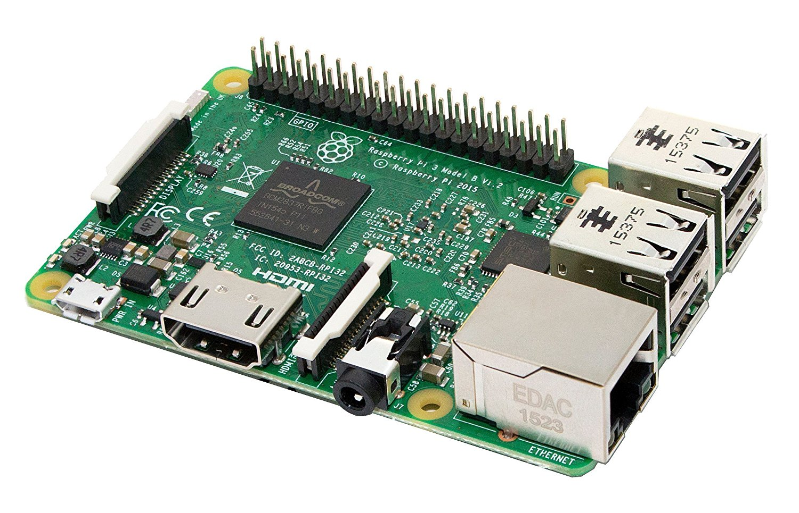
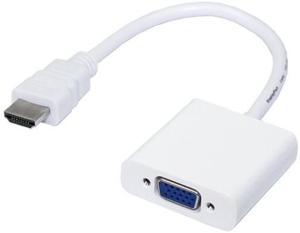
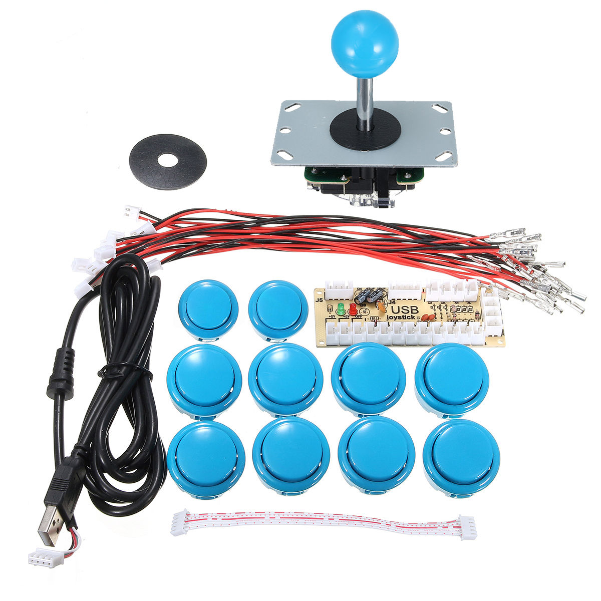
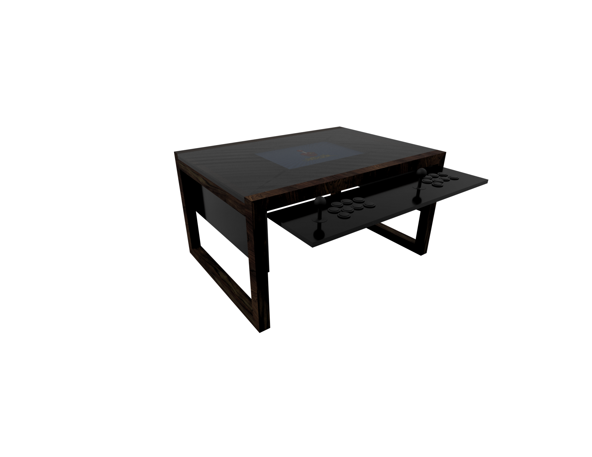
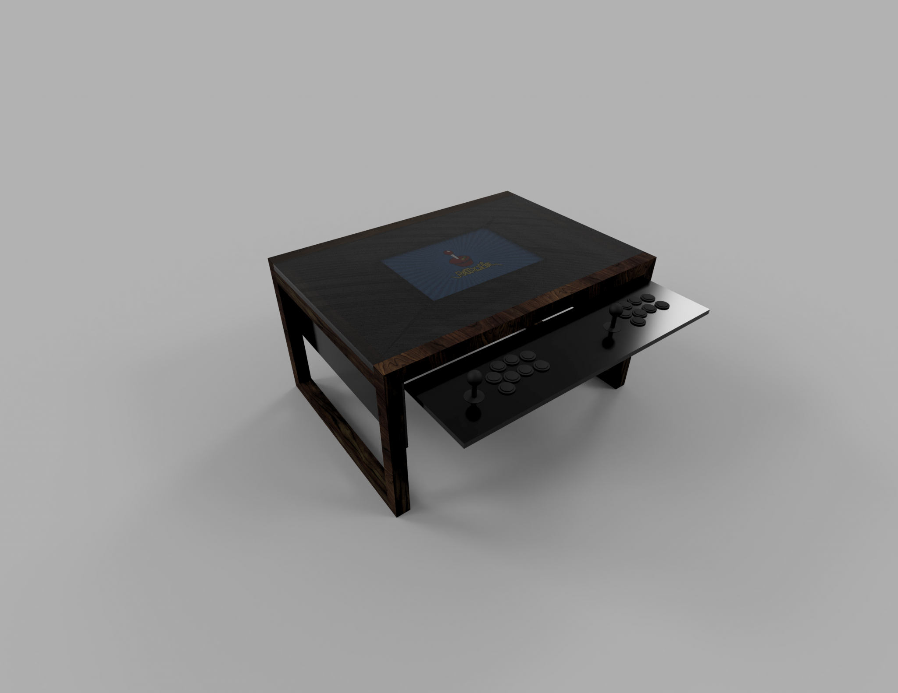
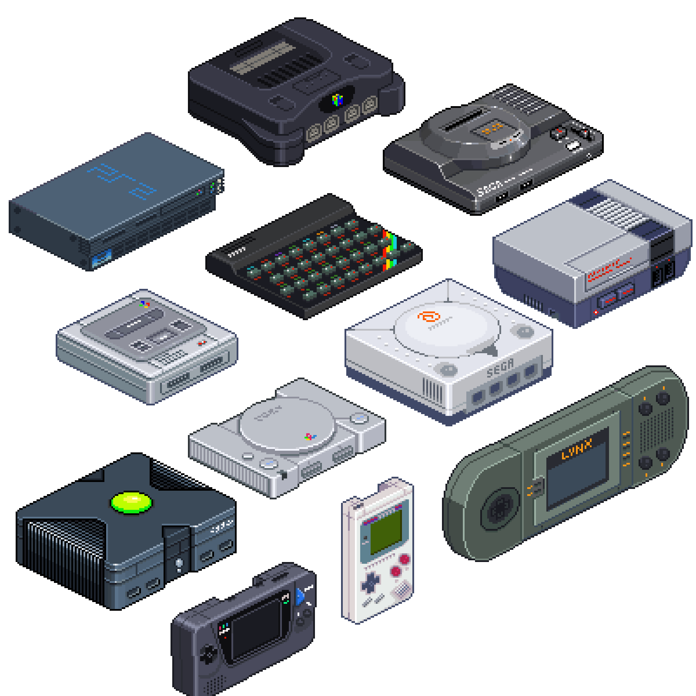
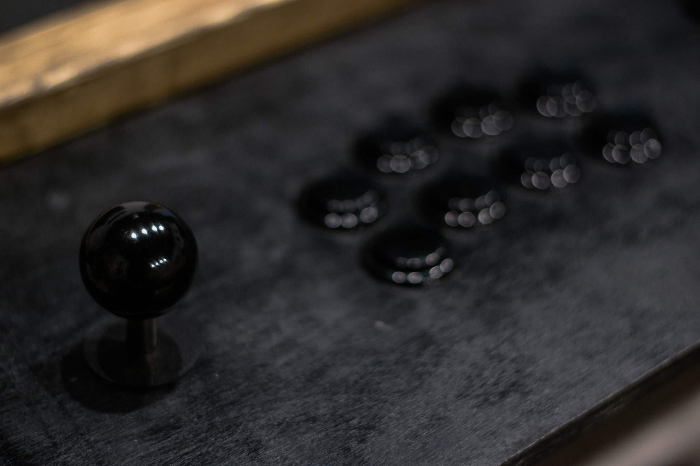
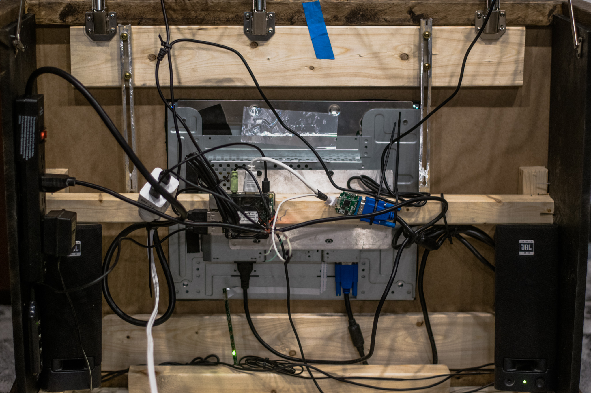
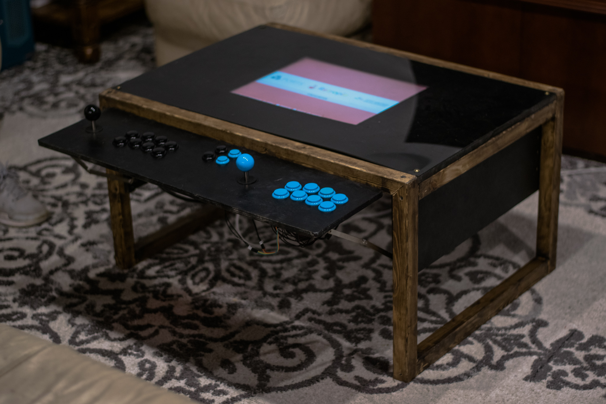

# Arcade Table
------------------------------------------- 

## Intro/Purpose
This project was developed out of our own desires. The three of us, Hunter, Lucas, and Peyton all contributed to the design. It was built to replace the current coffee table we had in our living space. We wanted it to fit in with the man-cave theme of our space and still serve as a coffee table. 

&nbsp;

## Parts List
|  | | |
|:---|---|:---:|
| **Raspberry Pi 3** ($35) | The Raspberry Pi is a credit card sized, single board, ARM computer that will run our system.||
| **HDMI to VGA video converter** ($7~$27) | The Raspberry Pi has video out as HDMI, but our monitor that we use only had VGA in. To solve this we used a simple HDMI to VGA adapter. We got ours from Amazon for relatively cheap. ||
| **Joysticks x2** ($13.90 ea.)| The controllers we used were the cheapest we could find were on eBay. They were not the highest quality but were very sturdy and we had no problems with them. Because of order miscommunication, we accidentally got a blue and black set instead of blue and red. They were really easy to set up. Although they did not come with wiring diagrams, the pins were all labeled on the controller board. The controller board is then connected via USB.||
| **Audio** | For sound, we used a simple set of JBL platinum series desktop speakers we had laying around.||
| **Screen** | For the screen, we disassembled an old dell flat screen monitor and took out only what we needed. ||


&nbsp;
&nbsp;
&nbsp;
&nbsp;

## Materials
For the frame, we used 1"x1" pine. For the table top and sides, we used MDF board painted black and then a sheet of acrylic above it. For the controller platform, we used projecting hinges to tuck away the board to create a seamless table-side and folding supports to lock it into place when in use. All of this was purchased from the local hardware store.




## Putting it together

### Hardware
To start off, we first built the frame of the table knowing that we could figure out how to fit all the components later. After contemplating may designs, we agreed to a simple table with a hinged platform for the controllers. The platform could be folded down when nobody is playing and easily hinged up to create a sturdy horizontal controller board. We built the frame out of the 1"x1", stained it with a dark stain. We then cut the MDF to fit inside the frame and then cut a hole in the middle to house the screen. We then cut 4 more MDF boards for the sides and controller platform. All the MDF was then painted black with a Rattle-Can enamel. After that, we fitted all the components together with standard drywall screws and topped it with a custom sized sheet of 1/4' thick acrylic. The hinging platform has 3 hinges in it and has 2 support arms on either side that snap into place when fully extended.


### Software
The Raspberry Pi is loaded with RetroPie operating system. It is an OS created specifically for the Pi and retro gaming. Based on Arch Linux and utilizing Emulation Station, it makes for the perfect front-end and environment for our project. It can emulate virtually any retro game you can think of. The image is downloaded from their site and written to the sd card using Win32DiskImager for Windows.

(Optional) The first thing we wanted to do was rotate the screen. to do so edit /boot/config.txt either by entering:

```
sudo nano /boot/config.txt
```

from within the pi's terminal or use a Linux system and insert the sd card into it and edit it with your favorite text editor. Add to the end of the file:

```
display_rotate=2
```

After that, the environment should be pretty easy to set up, just walk through the controller setup.

To load games onto the Pi, you can download the game ROM form EmuParadise and follow the instructions on the RetroPie page.

 

## Emulation
RetroPie is able to emulate almost any Retro Game including, but not limited to:

- Nintendo Entertainment System
- Nintendo Super NES
- Nintendo DS
- Gameboy Classic/Color/Advanced
- Game Cube
- Apple II https://github.com/RetroPie/RetroPie-Setup/wiki/Apple-II
- Macintosh OS https://github.com/RetroPie/RetroPie-Setup/wiki/Macintosh
- Arcade Cabinet Games (Per-game and Advanced Configuration Required)
- N64 (Requires Raspberry Pi 3 B+ or newer)
- Sony PlayStation (Requires Raspberry Pi 3 B+ or newer)
- Sony PSP (Requires Raspberry Pi 3 B+ or newer)
- Atari
- Sega (32X/CD/Master System/Genesis/Game Gear/Saturn)
- DOS (Recommended Raspberry Pi with higher Specs)
- ScummVM
- ZX Spectrum
- WII (Recommended Raspberry Pi with higher Specs)
- AND SO MUCH MORE!

*You can use virtually any controller also!*




## Sources

### RetroPie

Homepage: https://retropie.org.uk/

Download: [https://retropie.org.uk/download/](https://retropie.org.uk/download/)

Transferring Roms: [https://github.com/retropie/retropie-setup/wiki/Transferring-Roms](https://github.com/retropie/retropie-setup/wiki/Transferring-Roms)
 

### ROMs
 

EmuParadise: [https://www.emuparadise.me/roms-isos-games.php](https://www.emuparadise.me/roms-isos-games.php)   -Almost any ROM here can be emulated


## Gallery


|||
|--- | --- |
|||



