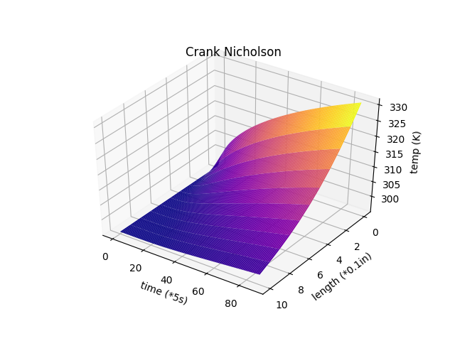
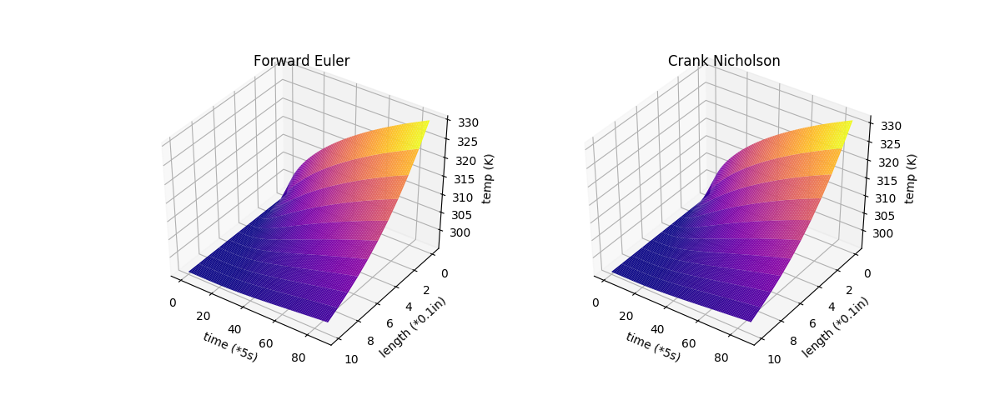
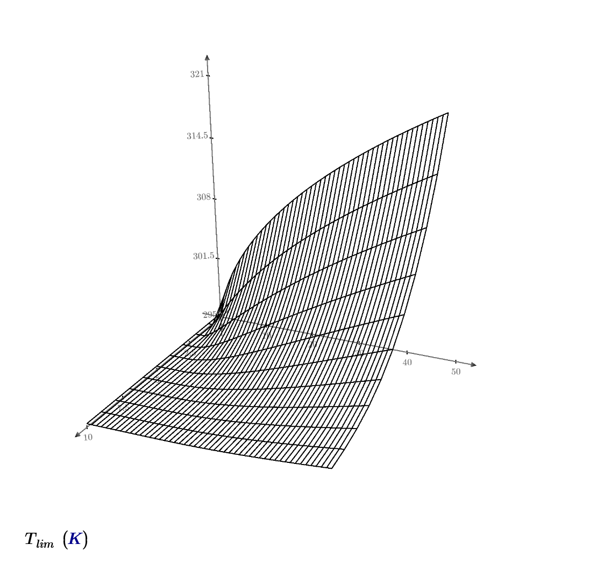
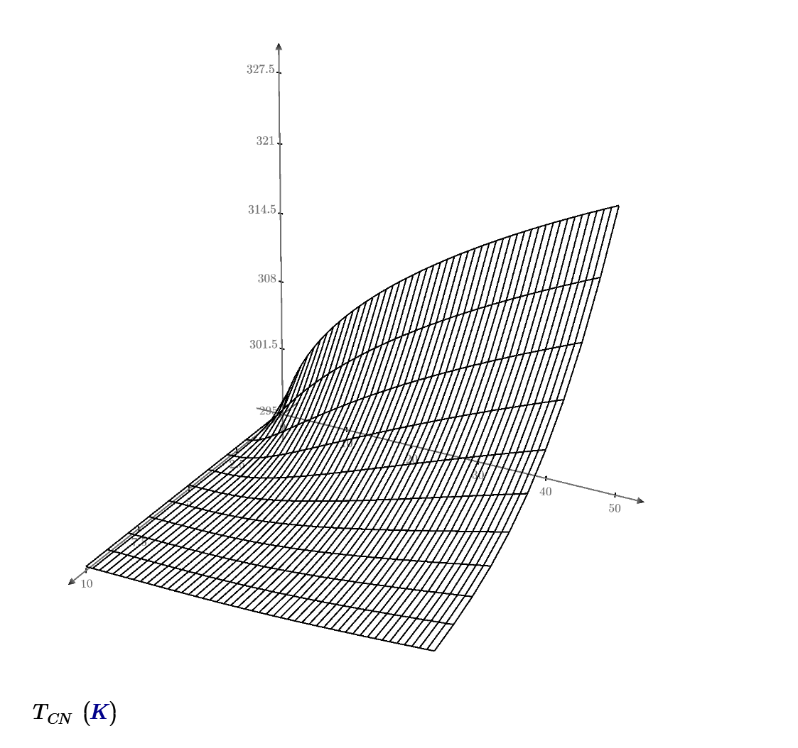

# Transient conduction
### Main article: [Heat equation](https://en.wikipedia.org/wiki/Heat_equation)
During any period in which temperatures changes in time at any place within an object, the mode of thermal energy flow is termed transient conduction. Another term is "non-steady-state" conduction, referring to time-dependence of temperature fields in an object. Non-steady-state situations appear after an imposed change in temperature at a boundary of an object. They may also occur with temperature changes inside an object, as a result of a new source or sink of heat suddenly introduced within an object, causing temperatures near the source or sink to change in time.

When a new perturbation of temperature of this type happens, temperatures within the system change in time toward a new equilibrium with the new conditions, provided that these do not change. After equilibrium, heat flow into the system once again equals the heat flow out, and temperatures at each point inside the system no longer change. Once this happens, transient conduction is ended, although steady-state conduction may continue if heat flow continues.

If changes in external temperatures or internal heat generation changes are too rapid for the equilibrium of temperatures in space to take place, then the system never reaches a state of unchanging temperature distribution in time, and the system remains in a transient state.

An example of a new source of heat "turning on" within an object, causing transient conduction, is an engine starting in an automobile. In this case, the transient thermal conduction phase for the entire machine is over, and the steady-state phase appears, as soon as the engine reaches steady-state operating temperature. In this state of steady-state equilibrium, temperatures vary greatly from the engine cylinders to other parts of the automobile, but at no point in space within the automobile does temperature increase or decrease. After establishing this state, the transient conduction phase of heat transfer is over.

New external conditions also cause this process: for example, the copper bar in the example steady-state conduction experiences transient conduction as soon as one end is subjected to a different temperature from the other. Over time, the field of temperatures inside the bar reaches a new steady-state, in which a constant temperature gradient along the bar is finally set up, and this gradient then stays constant in space. Typically, such a new steady-state gradient is approached exponentially with time after a new temperature-or-heat source or sink, has been introduced. When a "transient conduction" phase is over, heat flow may continue at high power, so long as temperatures do not change.

An example of transient conduction that does not end with steady-state conduction, but rather no conduction, occurs when a hot copper ball is dropped into oil at a low temperature. Here, the temperature field within the object begins to change as a function of time, as the heat is removed from the metal, and the interest lies in analyzing this spatial change of temperature within the object over time until all gradients disappear entirely (the ball has reached the same temperature as the oil). Mathematically, this condition is also approached exponentially; in theory, it takes infinite time, but in practice, it is over, for all intents and purposes, in a much shorter period. At the end of this process with no heat sink but the internal parts of the ball (which are finite), there is no steady-state heat conduction to reach. Such a state never occurs in this situation, but rather the end of the process is when there is no heat conduction at all.

The analysis of non-steady-state conduction systems is more complex than that of steady-state systems. If the conducting body has a simple shape, then exact analytical mathematical expressions and solutions may be possible (see heat equation for the analytical approach).[3] However, most often, because of complicated shapes with varying thermal conductivities within the shape (i.e., most complex objects, mechanisms or machines in engineering) often the application of approximate theories is required, and/or numerical analysis by computer. One popular graphical method involves the use of Heisler Charts.

Occasionally, transient conduction problems may be considerably simplified if regions of the object being heated or cooled can be identified, for which thermal conductivity is very much greater than that for heat paths leading into the region. In this case, the region with high conductivity can often be treated in the lumped capacitance model, as a "lump" of material with a simple thermal capacitance consisting of its aggregate heat capacity. Such regions warm or cool, but show no significant temperature variation across their extent, during the process (as compared to the rest of the system). This is due to their far higher conductance. During transient conduction, therefore, the temperature across their conductive regions changes uniformly in space, and as a simple exponential in time. An example of such systems is those that follow Newton's law of cooling during transient cooling (or the reverse during heating). The equivalent thermal circuit consists of a simple capacitor in series with a resistor. In such cases, the remainder of the system with a high thermal resistance (comparatively low conductivity) plays the role of the resistor in the circuit.

# [TransientConduction](https://github.com/phcreery/TransientConduction)
 Simple script to calculate and display 1 dimensional plane wall transient Thermal Conduction. Originally for an in-depth analysis of an insualtion wall of a solder reflow oven for a thermodynamic project

## Dependencies
 - python2.7 or 3
 - matplotlib
 - numpy
 
 ## Results
 
Heat equation 

 
 
 Which can be simplifed to the following for one dimension
 
 
 
 
 
Python Implimenataion

Mathcad Implimentation

## Sources
 - [phcreery/TransientConduction](https://github.com/phcreery/TransientConduction)
 - [Wikipedia: Transient Conduction](https://en.wikipedia.org/wiki/Thermal_conduction)
 - [Wikipedia: Crank-Nicolson](https://en.wikipedia.org/wiki/Crank%E2%80%93Nicolson_method)
 - [Hackaday Article by Matt Moses](https://hackaday.io/project/21642-repkiln/log/65537-numerically-solving-the-1d-transient-heat-equation)
 - [In depth comparison from Tennessee Technological University](https://www.cae.tntech.edu/~shan/numerical%20heat%20transfer%20note(ME4730_5730)/transient%201-D%20conduction(2013).pdf)
 - [Another Comparison by Hans Petter Langtangen](http://hplgit.github.io/num-methods-for-PDEs/doc/pub/diffu/sphinx/._main_diffu001.html)
 - [Hindered Settling python implimentation](https://hinderedsettling.com/2015/02/06/exploring-the-diffusion-equation-with-python/)
 - [Another Python implimentation Claudio Bellei](http://www.claudiobellei.com/2016/11/10/crank-nicolson/)
 - [Video Explanation by Sam R](https://www.youtube.com/watch?v=LihC0DzIibo&t=399s)

 
 

